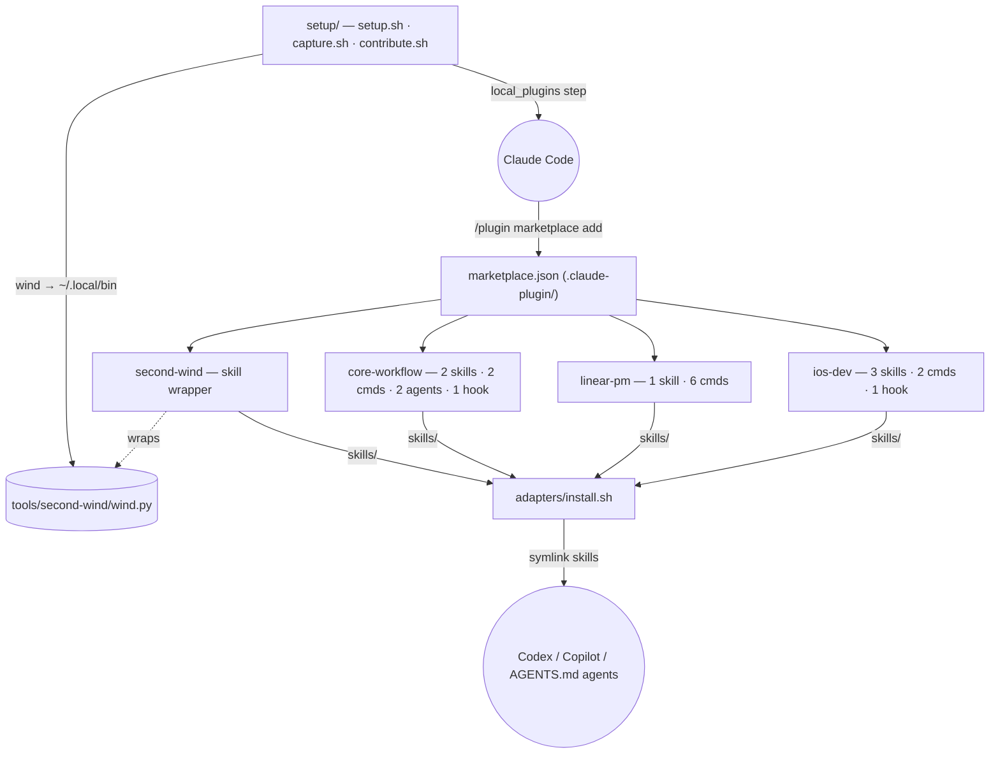

# Repository Architecture

> Visual version: [architecture.html](architecture.html) (open in a browser)

`claude-skills` is three things in one repo:

1. A **Claude Code plugin marketplace** hosting four focused plugins.
2. A home for **standalone CLI tools** (currently Second Wind).
3. **Adapters** that wire the same skills into Codex, Copilot CLI, and any AGENTS.md-aware agent.

Plus private **seed machinery** that rebuilds the owner's full dev environment on a fresh machine.

## System overview



## The four plugins

| Plugin | One-liner | Contents |
| --- | --- | --- |
| `ios-dev` | build → screenshot → phone → ship | app-preview, ios-build, release skills; `/preview`, `/fix`; build-reminder Stop hook |
| `linear-pm` | issue conventions + autonomous pickup | linear-pm skill; `/linear-init`, `/linear-new`, `/linear-pick`, `/linear-status`, `/linear-sync`, `/linear-block` |
| `core-workflow` | everyday glue | commit, contribute skills; `/team`, `/contribute-skill`; image-parser + web-researcher agents; shellcheck-on-edit hook |
| `second-wind` | outlast the 5-hour usage limit | SKILL.md wrapper for the `wind` CLI (self-installs when missing) |

Full per-item descriptions: [skills-catalog.md](skills-catalog.md).

## How installs flow

**Public user, Claude Code** — two commands:

```
/plugin marketplace add abhijitbansal/claude-skills
/plugin install <name>@claude-skills
```

**Public user, other agents** — clone, then one script:

```bash
adapters/install.sh codex      # or copilot, agents-md, all
```

**Owner, fresh machine** — `setup/setup.sh` runs eight idempotent steps:

```
preflight → claude → marketplaces → plugins → skills → dotfiles → local_plugins → symlinks
```

The `local_plugins` step adds this repo as a local marketplace and installs every plugin listed in
`marketplace.json` — the owner's machines use the **same mechanism the public does**, so there is no
second code path to drift. The `symlinks` step also cleans up pre-plugin-era symlinks and puts
`wind` and `claude-skills-contribute` on PATH.

## Directory map

| Path | What |
| --- | --- |
| `.claude-plugin/marketplace.json` | marketplace manifest — the list of plugins |
| `plugins/<name>/` | one plugin each: `.claude-plugin/plugin.json` + `skills/`, `commands/`, `agents/`, `hooks/` |
| `tools/second-wind/` | canonical `wind.py` + its pytest suite |
| `adapters/install.sh` | codex / copilot / agents-md wiring |
| `setup/` | seed machinery (setup, capture, contribute) |
| `templates/`, `claude-setup.toml` | personal machine seed data |
| `tests/` | bats (shell) + pytest suites |
| `docs/superpowers/` | design specs and implementation plans |

## Testing

- `bats tests/bats/` — shell behavior: setup steps, adapters, contribute flow, skill scripts, manifest validation.
- `uv tool run pytest tests/pytest -q` — TOML parse/write round-trip.
- `uv tool run pytest tools/second-wind/tests -q` — wind's limit-detection and classification logic.
- CI (GitHub Actions, macOS + Ubuntu): manifest validation, shellcheck, all three suites.
